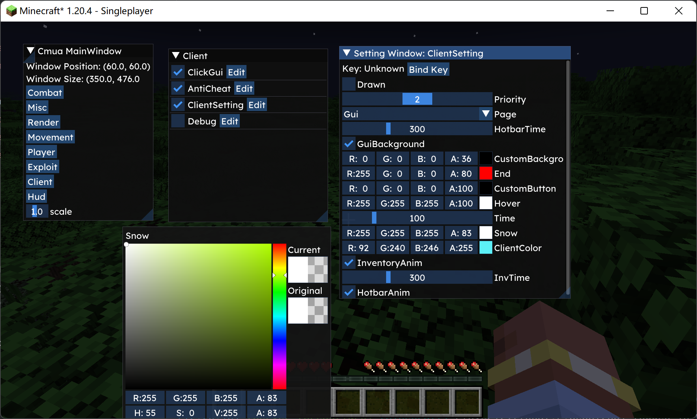

# OpenCmua

## Introduction

OpenCmua is a base for client dev. Current version 1.20.4. This project is a base for Minecraft designed to provide developers with a **simple**, **efficient**, and user-friendly development experience. It maintains an elegant code style while achieving a high degree of cohesion and loose coupling.


## Advantages

Below is a comparison with Alien([https://github.com/iM4dCat/Alien](https://github.com/iM4dCat/Alien)).

### scale

At present, the project has less than 3000 lines of code, which is very suitable for beginners to understand how the overall framework works.


### module

Compare to Alien, the following is the code that often needs to be rewritten in his module. We can see that in fact, most modules do not need to be rewritten, so these are redundant designs, and polling will only make performance worse.

```java
public void onDisable() {
}

public void onEnable() {
}

public void onToggle() {
}

public void onUpdate() {
}

public void onThread() {
}

public void onLogin() {
}

public void onLogout() {
}

public void onRender2D(DrawContext drawContext, float tickDelta) {
}

public void onRender3D(MatrixStack matrixStack) {
}
```

Therefore, in terms of module design, I only need three modules to be polling based, as these often require rewriting in most cases. The following is the relevant code in Cmua.

```java
public void onEnable() {
}

public void onUpdate() {
}

public void onDisable() {
}
```

But at this point, someone wants to ask, what if I want to draw 2D or 3D, and you don't have onRender2D and onRender3D. However, don't worry, there is an event system that can do this because using an event system is more efficient than polling. By default, we make the module a subscriber to events when it starts, and the relevant @EventHandler annotation allows it to successfully define the events it is interested in.

```java
@EventHandler
public void onRender2DEvent(Render2DEvent event) {
    // render 2d
}

@EventHandler
public void onRender3DEvent(Render3DEvent event) {
    // render3d
}
```

And we can also notice onThread, which is usually optimized using multithreading because doing too much in Tick can cause game lag. But compared to polling, I used my own implementation of a simple scheduler to complete it here. Here is an example, we just need to start a task where we needed to start before. Here is an example, which can be found in src/main/java/me/cmua/module/client/Debug. java.

```java
@Override
public void onUpdate() {
    // Test some situations that require a lot of computation, such as crystal calculations, and simulate them,
    // Do not directly place it on onUpdate, but use SimpleExecutor to submit tasks
    ManagerLoader.threadManager.getExecutor().submit(() -> {
        if (MinecraftUtil.playerOrWorldIsNull()) {
            return;
        }
        // get all player entities
        List<PlayerEntity> targets = new ArrayList<>();
        var self = MinecraftUtil.getPlayer();
        for (var player : MinecraftUtil.getWorld().getPlayers()) {
            if (self.getPos().distanceTo(player.getPos()) > 6) continue;
            if (ManagerLoader.friendManager.isFriend(player.getName().getString())) continue;
            if (player.getName().getString().equals(self.getName().getString())) continue;
            targets.add(player);
        }

        // do more thing
        // ...
    });
}
```


### config

Cmua uses JSON to manage configuration. This makes it easier to edit some configurations from files and easier to read. 

```json
{
  "ClientSetting": {
    "name": "ClientSetting",
    "Key": -1,
    "Drawn": false,
    "WindowTitle": "Cmua",
    "TitleOverride": true,
    "Log": true,
    "HotbarTime": 300,
    "GuiBackground": true,
    "CustomBackground": {
      "red": 0.0,
      "green": 0.0,
      "blue": 0.0,
      "alpha": 0.14117648
    }
    ...
  }
}
```


### gui

You know, if we use the relevant interfaces of Minecraft to draw, it will make the program deeply bound to Minecraft. Therefore, I used ImGui, which allows us to debug our GUI part separately from Minecraft. And I implemented the GUI part with very little code, which is quite impressive.



